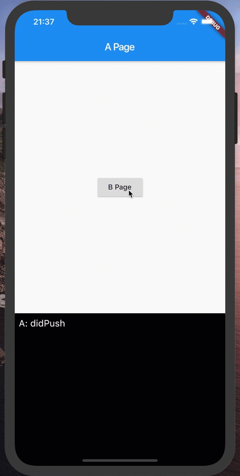

# route_observer_mixin



RouteObserveMixin provides easy access to didPush/didPop/didPushNext/didPopNext.

## Usage

### 1. Wrap MaterialApp with RouteObserverProvider.

```dart
void main() {
  runApp(
    MultiProvider(
      providers: [
        // 1. Wrap MaterialApp with RouteObserverProvider.
        RouteObserverProvider(),
        ChangeNotifierProvider(create: (context) => Logger())
      ],
      child: const App(),
    ),
  );

  // Of course, this is also ok.
  // I demonstrated that [MultiProvider] can be used for RouteObserverProvider👍

  /*
  runApp(
    RouteObserverProvider(
      child: App(),
    ),
  );
  */
}
```

###  2. Pass RouteObserverProvider.of(context) to navigatorObservers.


```dart
class App extends StatelessWidget {
  @override
  Widget build(BuildContext context) {
    return MaterialApp(
      // 2. Pass RouteObserverProvider.of(context) to navigatorObservers.
      navigatorObservers: [RouteObserverProvider.of(context)],
      home: const APage(),
    );
  }
}
```

### 3. Add `with RouteAware, RouteObserverMixin` to State and override RouteAware methods.

```dart
class APage extends StatefulWidget {
  const APage({Key key}) : super(key: key);

  @override
  _APageState createState() => _APageState();
}

// 3. Add `with RouteAware, RouteObserverMixin` to State and override RouteAware methods.
class _APageState extends State<APage> with RouteAware, RouteObserverMixin {

  @override
  Widget build(BuildContext context) {
    return Scaffold(
      appBar: AppBar(
        title: const Text('A Page'),
      ),
      body: Center(
        child: RaisedButton(
          onPressed: () {
            Navigator.of(context).push<void>(
              MaterialPageRoute(
                builder: (context) => const BPage(),
              ),
            );
          },
          child: const Text('B Page'),
        ),
      ),
    );
  }

  /// Called when the top route has been popped off, and the current route
  /// shows up.
  @override
  void didPopNext() { }

  /// Called when the current route has been pushed.
  @override
  void didPush() { }

  /// Called when the current route has been popped off.
  @override
  void didPop() { }

  /// Called when a new route has been pushed, and the current route is no
  /// longer visible.
  @override
  void didPushNext() { }
}
```


## Example

- https://github.com/mono0926/route_observer_mixin/tree/master/example